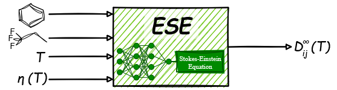

# ESE

## Overview



This repository contains the implementation of the Enhanced Stokes–Einstein (ESE) model for predicting diffusion coefficients at infinite dilution in pure solvents.
Details are provided in the associated [paper](https://arxiv.org/abs/2603.02761).

---

## Repository Structure
```text
ese/
│
├── functions/
│   ├── driver.py       # Prediction workflow logic
│   ├── models.py       # Neural network architecture
│   └── parser.py       # Input processing and validation
│
├── images/
│   └── TOC.png         # TOC figure
│
├── params/
│   ├── ESE_0.pt        # Ensemble member weights
│   ├── ESE_1.pt
│   ├── ...
│   └── ESE_9.pt
│
├── ESE.py              # Main execution script
│
├── LICENSE
├── README.md
└── requirements.txt

```

---

## Installation
```bash
git clone https://github.com/jenswag/ese.git
cd ese
pip install -r requirements.txt
```
---

## Usage
### Define Input
Inputs must be defined directly in ESE.py before execution.<br>
Specify:
```bash
solute = '<SMILES>'     # SMILES Solute i
solvent = '<SMILES>'    # SMILES Solvent j
T = <float>             # Temperature Solvent j [K]
v = <float>             # Viscosity Solvent j [mPas]
```

### Run ESE
```bash
python ESE.py
```

---

## Requirements
All dependencies are listed in requirements.txt

---

## License
This project is licensed under the MIT License. See LICENSE file for details.

---

## Citation
If you use the ESE model in scientific research, please cite the following paper:
```bibtex
@misc{Wagner2026ESE,
  doi = {10.48550/ARXIV.2603.02761},
  url = {https://arxiv.org/abs/2603.02761},
  author = {Wagner, Jens and Romero, Zeno and M\"{u}nnemann, Kerstin and Schmitt, Sebastian and Specht, Thomas and Hasse, Hans and Jirasek, Fabian},
  title = {Hybrid Machine Learning for Enhanced Prediction of Diffusion Coefficients in Liquids},
  publisher = {arXiv},
  year = {2026}
}
```